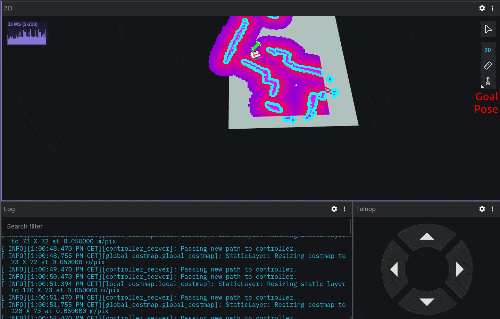

# rosbot-autonomy

A step-by-step guide for the ROSbot 2R/PRO to map an unknown environment and navigate autonomously within it from RViz. Works over the Internet thanks to Husarnet VPN

You can test the robot's autonomy on two branches:

- [**ros2router**](https://github.com/husarion/rosbot-autonomy/) (rviz2)
- [**foxglove**](https://github.com/husarion/rosbot-autonomy/tree/foxglove)

## Quick start

### ⬇️ Step 1: Clone repository

Go to the directory in which you want to save the project and execute the following commands:

```bash
git clone https://github.com/husarion/rosbot-autonomy
cd rosbot-autonomy
```

### 🌎 Step 2: Connecting ROSbot and Laptop over VPN

Ensure that both ROSbot 2R and your laptop linked to the same Husarnet VPN network. If they are not follow these steps:

1. Setup a free account at [app.husarnet.com](https://app.husarnet.com/), create a new Husarnet network, click the **[Add element]** button and copy the code from the **Join Code** tab.
2. Connect your laptop to the [Husarnet network](https://husarnet.com/docs). If you are Ubuntu user, just run:

   ```bash
   curl https://install.husarnet.com/install.sh | sudo bash
   ```

   and connect to the Husarnet network with:

   ```bash
   sudo husarnet join <paste-join-code-here>
   ```

3. Connect your ROSbot to the Husarnet network. Husarnet is already pre-installed so just run:

   ```bash
   sudo husarnet join <paste-join-code-here> rosbot2r
   ```

> [!NOTE]
> `rosbot2r` is the robot name that will be used to connect to the robot. This name is related to the robot's namespace.

### 📡 Step 3: Sync

This repository contains the Docker Compose setup for both PC and ROSbot 2, 2R and 2 PRO. You can clone it to both PC and ROSbot 2, 2R and 2 PRO, or use the `sync_with_rosbot.sh` script to clone it to your PC and keep it synchronized with the robot

```bash
./sync_with_rosbot.sh rosbot2r
```

> [!NOTE]
> This `sync_with_rosbot.sh` script locks the terminal and synchronizes online all changes made locally on the robot. `rosbot2r` is the name of device set in Husarnet.

### 🔧 Step 4: Verifying User Configuration

To ensure proper user configuration, review the content of the `.env` file and select the appropriate configuration (the default options should be suitable).

- **`LIDAR_BAUDRATE`** - depend on mounted LiDAR
- **`MECANUM`** - wheel type
- **`SLAM`** - choose between mapping and localization modes
- **`SAVE_MAP_PERIOD`** - period of time for autosave map (set `0` to disable)
- **`CONTROLLER`** - choose the navigation controller type
- **`ROBOT_NAMESPACE`** - type your ROSbot device name the same as in Husarnet.

> [!IMPORTANT]
> Modify the `.env` file and set ROSbot's namespace. Should be the same as Husarnet device name.

### 🤖 Step 5: Running Autonomy

Below are three options for starting autonomy:

- on a physical ROSbot
- in the Gazebo simulation
- in Webots simulation

> [!IMPORTANT]
> The `compose.sim.gazebo.yaml` and `compose.sim.webots.yaml` files use NVIDIA Container Runtime. Make sure you have NVIDIA GPU and the [NVIDIA Container Toolkit](https://docs.nvidia.com/datacenter/cloud-native/container-toolkit/install-guide.html) installed.

---

#### I. ROSbot 2R and 2 PRO

To enable autonomy on the robot, it is necessary:

- starting autonomy on ROSbot (`compose.yaml`)
- launching visualization on PC (`compose.pc.yaml`)

##### ROSbot Actions

Run Docker images defined in `compose.yaml` inside `rosbot-autonomy` on ROSbot:

1. Connect to the ROSbot

   ```bash
   ssh husarion@rosbot2r
   ```

   > [!NOTE]
   > `rosbot2r` is the name of device set in Husarnet.

2. Pulling the latest version

   ```bash
   docker compose pull
   ```

3. Flashing the ROSbot's Firmware

   To flash the Micro-ROS based firmware for STM32F4 microcontroller responsible for low-level functionalities of ROSbot 2, 2R and 2 PRO, execute in the ROSbot's shell:

   ```bash
   ./flash_rosbot_firmware.sh
   ```

4. Running autonomy

   ```bash
   docker compose up
   ```

##### PC

To initiate a user interface and navigation stack based on RViz, execute these commands on your PC:

```bash
xhost +local:docker && \
docker compose -f compose.pc.yaml up
```

#### Gazebo Simulation

Start the containers in a new terminal:

```bash
xhost +local:docker && \
docker compose -f compose.sim.gazebo.yaml up
```

#### Webots Simulation

Start the containers in a new terminal:

```bash
xhost +local:docker && \
docker compose -f compose.sim.webots.yaml up
```

---


### Result



> [!NOTE]
> To instruct the robot to autonomously explore new areas and create a map (in "slam" mode) of **[2D Goal Pose]** in RViz. Please note that whenever you disable `SLAM`, you must disable the containers with the `docker compose down` command. When `SLAM` is off, you can indicate the robot's current position by **[2D Pose Estimate]** button.


## Developer info

### pre-commit

[pre-commit configuration](.pre-commit-config.yaml) checks file formats before contributing. Usage:

```bash
# install pre-commit
pip install pre-commit

# initialize pre-commit workspace
pre-commit install

# manually run tests
pre-commit run -a
```
